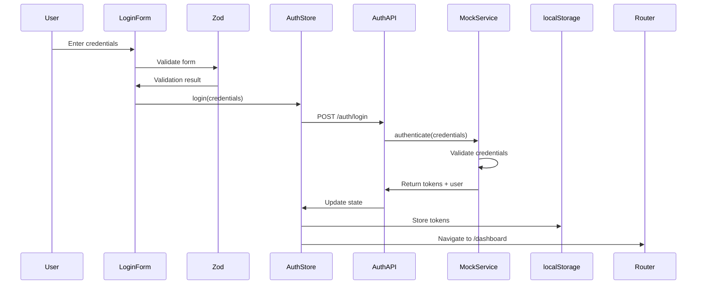
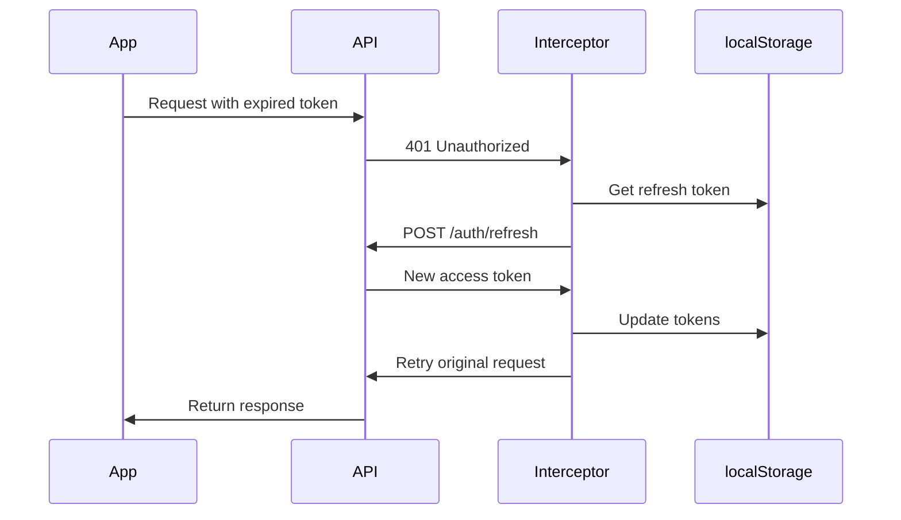
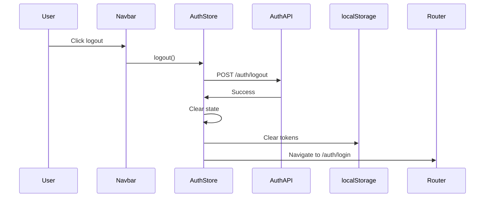

# Authentication System Documentation

## Table of Contents
- [Overview](#overview)
- [Features](#features)
- [Architecture](#architecture)
- [Components](#components)
- [Authentication Flow](#authentication-flow)
- [API Integration](#api-integration)
- [State Management](#state-management)
- [Mock Authentication](#mock-authentication)
- [Usage Examples](#usage-examples)
- [Testing](#testing)
- [Security](#security)

## Overview

The authentication system provides complete user authentication with login, signup, JWT token management, and protected routes. It's built to work seamlessly with both mock data (development) and real API endpoints (production).

### Key Features

- ✅ Email/Password authentication
- ✅ JWT access & refresh tokens
- ✅ Automatic token refresh
- ✅ Protected routes
- ✅ Persistent authentication
- ✅ Mock users for development
- ✅ Dev user switcher
- ✅ Error handling
- ✅ Loading states
- ✅ Form validation

## Features

### 1. Login & Signup
- Beautiful, responsive auth pages
- Form validation with Zod
- Error messages
- Loading states
- Remember me functionality
- Password visibility toggle

### 2. Token Management
- JWT access tokens (15 minutes)
- Refresh tokens (7 days)
- Automatic token refresh
- Token storage in localStorage
- Token validation

### 3. Protected Routes
- Route-level protection
- Automatic redirects
- State preservation
- Loading states during verification

### 4. User Management
- User profile data
- User metadata
- Role-based access
- Department assignments
- Clearance levels

### 5. Development Tools
- Mock users with different roles
- Dev user switcher (bottom-right)
- Quick user switching
- No backend required for development

## Architecture

### File Structure

```
src/features/auth/
├── components/           # Auth UI components
│   ├── AuthLayout.tsx    # Auth page layout
│   ├── LoginForm.tsx     # Login form
│   ├── SignupForm.tsx    # Signup form
│   ├── ProtectedRoute.tsx # Route protection
│   ├── DevUserSwitcher.tsx # Dev tool
│   ├── LoginPage.tsx     # Login page
│   ├── SignupPage.tsx    # Signup page
│   └── index.ts
├── mocks/               # Mock data
│   ├── mock-users.ts    # Mock user data
│   ├── mock-auth-service.ts # Mock API
│   └── index.ts
├── store/               # State management
│   └── auth.store.ts    # Zustand store
├── types/               # TypeScript types
│   └── auth.types.ts    # Auth interfaces
├── authapi.ts           # Auth API service
├── authschema.ts        # Zod schemas
├── index.ts             # Barrel export
└── README.md            # This file
```

### Data Flow

```
User Action (Login)
      ↓
LoginForm Component
      ↓
Form Validation (Zod)
      ↓
Auth Store (login action)
      ↓
Auth API Service
      ↓
Mock Auth Service (Dev)
      ↓
Generate/Validate Tokens
      ↓
Update Store + localStorage
      ↓
Redirect to Dashboard
```

## Components

### AuthLayout

Provides consistent layout for auth pages (login, signup).

```typescript
<AuthLayout
  title="Sign In"
  subtitle="Welcome back! Please enter your details."
>
  <LoginForm />
</AuthLayout>
```

**Features:**
- Responsive design (mobile & desktop)
- Branding section (desktop only)
- Form section with card
- Footer links

### LoginForm

Login form with email/password authentication.

```typescript
<LoginForm />
```

**Features:**
- Email validation
- Password visibility toggle
- Remember me checkbox
- Forgot password link
- Form validation with Zod
- Error display
- Loading state

**Schema:**
```typescript
{
  email: string (valid email),
  password: string (min 8 chars),
  rememberMe?: boolean
}
```

### SignupForm

Registration form for new users.

```typescript
<SignupForm />
```

**Features:**
- First name, last name, email fields
- Password & confirm password
- Password strength indicator
- Terms & conditions checkbox
- Form validation
- Error display
- Loading state

**Schema:**
```typescript
{
  firstName: string (min 2 chars),
  lastName: string (min 2 chars),
  email: string (valid email),
  password: string (min 8 chars, special chars),
  confirmPassword: string (must match),
  acceptTerms: boolean (must be true)
}
```

### ProtectedRoute

Wraps routes that require authentication.

```typescript
// Protected route (requires auth)
<ProtectedRoute>
  <Dashboard />
</ProtectedRoute>

// Public route (no auth required)
<ProtectedRoute requireAuth={false}>
  <LoginPage />
</ProtectedRoute>
```

**Features:**
- Redirects to login if not authenticated
- Redirects away from auth pages if authenticated
- Preserves intended destination
- Shows loading state during verification
- Verifies token on mount

### DevUserSwitcher

Development tool for quick user switching (bottom-right corner).

```typescript
<DevUserSwitcher />
```

**Features:**
- Lists all mock users
- Shows current user
- Quick switch buttons
- Role & department display
- Only visible in development

## Authentication Flow

### Login Flow



### Token Refresh Flow



### Logout Flow



## API Integration

### Auth API Service

Located in `src/features/auth/authapi.ts`

#### Login
```typescript
const result = await authAPI.login({
  email: 'user@example.com',
  password: 'password123'
});

// Returns: { user, tokens }
```

#### Signup
```typescript
const result = await authAPI.signup({
  firstName: 'John',
  lastName: 'Doe',
  email: 'john@example.com',
  password: 'password123'
});

// Returns: { user, tokens }
```

#### Logout
```typescript
await authAPI.logout();
```

#### Refresh Token
```typescript
const tokens = await authAPI.refreshToken(refreshToken);

// Returns: { accessToken, refreshToken }
```

#### Get Current User
```typescript
const user = await authAPI.getCurrentUser();

// Returns: IUser
```

### Axios Interceptors

Configured in `src/lib/axios/axios.interceptors.ts`

**Request Interceptor:**
- Adds `Authorization` header with access token
- Logs requests in dev mode
- Adds request metadata

**Response Interceptor:**
- Catches 401 errors
- Automatically refreshes tokens
- Retries failed requests
- Transforms errors

## State Management

### Zustand Store

Located in `src/features/auth/store/auth.store.ts`

#### State Shape

```typescript
interface AuthState {
  // State
  user: IUser | null;
  tokens: IAuthTokens | null;
  isLoading: boolean;
  isAuthenticated: boolean;
  error: IAuthError | null;

  // Actions
  login: (credentials: LoginFormData) => Promise<void>;
  signup: (data: SignupFormData) => Promise<void>;
  logout: () => Promise<void>;
  refreshTokens: () => Promise<void>;
  verifyAuth: () => Promise<void>;
  setUser: (user: IUser) => void;
  clearError: () => void;
}
```

#### Usage

```typescript
import { useAuthStore } from '@/features/auth';

function Component() {
  // Select specific state
  const user = useAuthStore((state) => state.user);
  const isAuthenticated = useAuthStore((state) => state.isAuthenticated);
  
  // Select actions
  const login = useAuthStore((state) => state.login);
  const logout = useAuthStore((state) => state.logout);
  
  // Use in handlers
  const handleLogin = async () => {
    await login({ email, password });
  };
}
```

### Persistence

Tokens are persisted in localStorage:

```typescript
// Storage keys
AUTH_STORAGE_KEY = 'auth_tokens'
USER_STORAGE_KEY = 'auth_user'

// Stored data
{
  accessToken: string,
  refreshToken: string,
  expiresIn: number,
  tokenType: 'Bearer'
}
```

## Mock Authentication

### Mock Users

Pre-defined users in `src/features/auth/mocks/mock-users.ts`:

| Email | Role | Department | Clearance | Password |
|-------|------|------------|-----------|----------|
| admin@example.com | ADMIN | ADMIN | 5 | Password123! |
| john.doe@example.com | USER | ENGINEERING | 2 | Password123! |
| jane.smith@example.com | MANAGER | HR | 3 | Password123! |
| moderator@example.com | MODERATOR | SUPPORT | 2 | Password123! |
| finance@example.com | USER | FINANCE | 3 | Password123! |
| sales@example.com | USER | SALES | 1 | Password123! |
| hr@example.com | USER | HR | 3 | Password123! |
| guest@example.com | GUEST | - | - | Password123! |

### Mock Service

Located in `src/features/auth/mocks/mock-auth-service.ts`

Simulates real API behavior:

- Validates credentials
- Generates JWT tokens
- Implements delays (realistic)
- Returns appropriate errors
- Handles token refresh

### Switching to Real API

1. Update `VITE_API_BASE_URL` in `.env`
2. Replace mock service imports in `authapi.ts`
3. Remove DevUserSwitcher from production
4. Update token storage (use HttpOnly cookies)

## Usage Examples

### 1. Login

```typescript
import { useAuthStore } from '@/features/auth';

function MyComponent() {
  const login = useAuthStore((state) => state.login);
  const isLoading = useAuthStore((state) => state.isLoading);
  const error = useAuthStore((state) => state.error);

  const handleLogin = async (email: string, password: string) => {
    try {
      await login({ email, password });
      // Redirect handled by store
    } catch (error) {
      // Error handled by store
      console.error('Login failed:', error);
    }
  };

  return (
    <div>
      {error && <p>{error.message}</p>}
      <button onClick={() => handleLogin('user@example.com', 'password')} disabled={isLoading}>
        {isLoading ? 'Logging in...' : 'Login'}
      </button>
    </div>
  );
}
```

### 2. Protected Component

```typescript
import { useAuthStore } from '@/features/auth';

function ProtectedComponent() {
  const user = useAuthStore((state) => state.user);
  const isAuthenticated = useAuthStore((state) => state.isAuthenticated);

  if (!isAuthenticated) {
    return <Navigate to="/auth/login" />;
  }

  return (
    <div>
      <h1>Welcome, {user.firstName}!</h1>
      {/* Protected content */}
    </div>
  );
}
```

### 3. User Profile Display

```typescript
import { useAuthStore } from '@/features/auth';

function UserProfile() {
  const user = useAuthStore((state) => state.user);

  if (!user) return null;

  return (
    <div>
      
      <h2>{user.firstName} {user.lastName}</h2>
      <p>{user.email}</p>
      <p>Role: {user.role}</p>
      <p>Department: {user.metadata?.department}</p>
    </div>
  );
}
```

### 4. Logout

```typescript
import { useAuthStore } from '@/features/auth';
import { useNavigate } from 'react-router';

function LogoutButton() {
  const logout = useAuthStore((state) => state.logout);
  const navigate = useNavigate();

  const handleLogout = async () => {
    await logout();
    navigate('/auth/login');
  };

  return <button onClick={handleLogout}>Logout</button>;
}
```

## Testing

### Testing with Mock Users

1. Use DevUserSwitcher (development only)
2. Click different users to switch
3. Observe permission changes
4. Test different roles and departments

### Manual Testing Checklist

- [ ] Login with valid credentials
- [ ] Login with invalid credentials
- [ ] Signup with valid data
- [ ] Signup with invalid data
- [ ] Password visibility toggle
- [ ] Remember me functionality
- [ ] Logout
- [ ] Token refresh (wait 15 min)
- [ ] Protected routes redirect
- [ ] Auth persistence (refresh page)
- [ ] Dev user switcher

### Unit Testing

```typescript
import { renderHook, act } from '@testing-library/react';
import { useAuthStore } from './auth.store';

describe('Auth Store', () => {
  it('should login successfully', async () => {
    const { result } = renderHook(() => useAuthStore());
    
    await act(async () => {
      await result.current.login({
        email: 'test@example.com',
        password: 'password123'
      });
    });
    
    expect(result.current.isAuthenticated).toBe(true);
    expect(result.current.user).toBeDefined();
  });
});
```

## Security

### Best Practices

1. **Never store tokens in localStorage in production**
   - Use HttpOnly cookies instead
   - Prevents XSS attacks

2. **Always validate tokens on the server**
   - Client-side validation is for UX only
   - Server must verify all requests

3. **Use HTTPS in production**
   - Prevents man-in-the-middle attacks
   - Protects tokens in transit

4. **Implement rate limiting**
   - Prevent brute force attacks
   - Limit login attempts

5. **Use strong passwords**
   - Minimum 8 characters
   - Require special characters
   - Implement password strength meter

6. **Implement CSRF protection**
   - Use CSRF tokens
   - Validate origin headers

7. **Monitor for suspicious activity**
   - Log failed login attempts
   - Alert on unusual patterns
   - Implement account lockout

### Token Security

- **Access Token:** Short-lived (15 min), sent with each request
- **Refresh Token:** Longer-lived (7 days), used only to get new access tokens
- **Token Rotation:** Generate new refresh token on each refresh
- **Token Revocation:** Implement token blacklist on backend

## Troubleshooting

### Common Issues

**Issue:** "Token expired" errors
- **Solution:** Token refresh should happen automatically. Check network tab for refresh requests.

**Issue:** Redirect loop on protected routes
- **Solution:** Check token validity and `isAuthenticated` state.

**Issue:** User data not persisting
- **Solution:** Check localStorage for tokens. Clear storage and re-login.

**Issue:** Login fails with valid credentials
- **Solution:** Check console for errors. Verify mock service is working.

## Future Enhancements

- [ ] Email verification
- [ ] Password reset flow
- [ ] Two-factor authentication (2FA)
- [ ] Social authentication (Google, GitHub)
- [ ] Session management
- [ ] Device management
- [ ] Audit logs
- [ ] Account security settings

---

For more information, see:
- [Architecture Documentation](../ARCHITECTURE.md)
- [Authorization Documentation](./AUTHORIZATION.md)
- [Developer Guide](../DEVELOPER_GUIDE.md)

